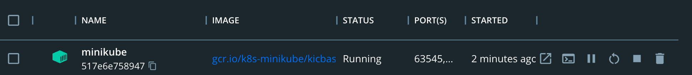
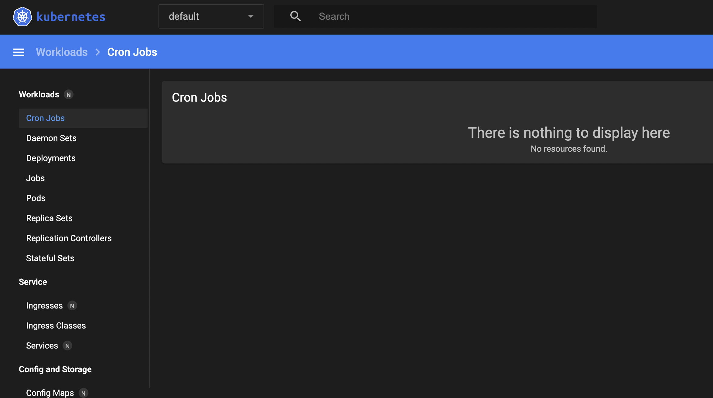

# Kubernetes Setup

Prerequisites

- Docker and Docker Compose: https://github.com/jvalentino/setup-docker
- Git: https://github.com/jvalentino/setup-git

# (1) Setup

Per https://minikube.sigs.k8s.io/docs/start/

## Mac

```bash
brew install minikube
```

# (2) Starting the Cluster

```bash
$ minikube start

😄  minikube v1.28.0 on Darwin 12.3 (arm64)
✨  Automatically selected the docker driver
📌  Using Docker Desktop driver with root privileges
👍  Starting control plane node minikube in cluster minikube
🚜  Pulling base image ...
💾  Downloading Kubernetes v1.25.3 preload ...
    > preloaded-images-k8s-v18-v1...:  320.81 MiB / 320.81 MiB  100.00% 30.68 M
    > gcr.io/k8s-minikube/kicbase:  347.52 MiB / 347.52 MiB  100.00% 13.18 MiB 
    > gcr.io/k8s-minikube/kicbase:  0 B [________________________] ?% ? p/s 15s
🔥  Creating docker container (CPUs=2, Memory=7803MB) ...
🐳  Preparing Kubernetes v1.25.3 on Docker 20.10.20 ...
    ▪ Generating certificates and keys ...
    ▪ Booting up control plane ...
    ▪ Configuring RBAC rules ...
🔎  Verifying Kubernetes components...
    ▪ Using image gcr.io/k8s-minikube/storage-provisioner:v5
🌟  Enabled addons: storage-provisioner, default-storageclass
🏄  Done! kubectl is now configured to use "minikube" cluster and "default" namespace by default
```

If you are running Docker Desktop, you will see a container for it:



Additionally there are commands to can run to inspect the current state:

```bash
$ kubectl get po -A
NAMESPACE     NAME                               READY   STATUS    RESTARTS   AGE
kube-system   coredns-565d847f94-242wz           1/1     Running   0          3m47s
kube-system   etcd-minikube                      1/1     Running   0          4m
kube-system   kube-apiserver-minikube            1/1     Running   0          4m2s
kube-system   kube-controller-manager-minikube   1/1     Running   0          4m
kube-system   kube-proxy-jqg8q                   1/1     Running   0          3m47s
kube-system   kube-scheduler-minikube            1/1     Running   0          4m
kube-system   storage-provisioner                1/1     Running   0          3m59s
```

Most important, you can launch a dasboard for visually keeping track of all this:

```bash
minikube dashboard
```



# (3) Proving it out

```bash
kubectl create deployment hello-minikube --image=kicbase/echo-server:1.0
kubectl expose deployment hello-minikube --type=NodePort --port=8080
minikube service hello-minikube
```

This will do the following:

1. Create a deployment based on the `kicbase/echo-server:1.0` image
2. Mkaing that deployment available
3. Open up that service in the web-broswer

The resulting will look like this:

```properties
Request served by hello-minikube-7ddcbc9b8b-7grjx

HTTP/1.1 GET /

Host: 127.0.0.1:64558
Accept: text/html,application/xhtml+xml,application/xml;q=0.9,image/avif,image/webp,image/apng,*/*;q=0.8,application/signed-exchange;v=b3;q=0.9
Accept-Encoding: gzip, deflate, br
Accept-Language: en-US,en;q=0.9
Connection: keep-alive
Sec-Ch-Ua: "Google Chrome";v="107", "Chromium";v="107", "Not=A?Brand";v="24"
Sec-Ch-Ua-Mobile: ?0
Sec-Ch-Ua-Platform: "macOS"
Sec-Fetch-Dest: document
Sec-Fetch-Mode: navigate
Sec-Fetch-Site: none
Sec-Fetch-User: ?1
Upgrade-Insecure-Requests: 1
User-Agent: Mozilla/5.0 (Macintosh; Intel Mac OS X 10_15_7) AppleWebKit/537.36 (KHTML, like Gecko) Chrome/107.0.0.0 Safari/537.36
```


# References

- https://minikube.sigs.k8s.io/docs/start/